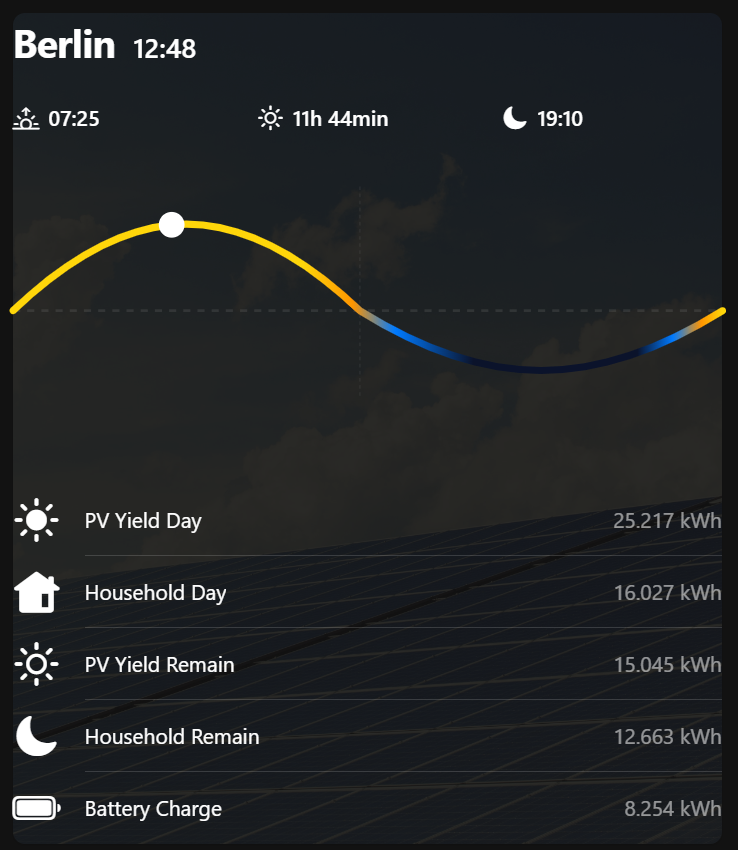
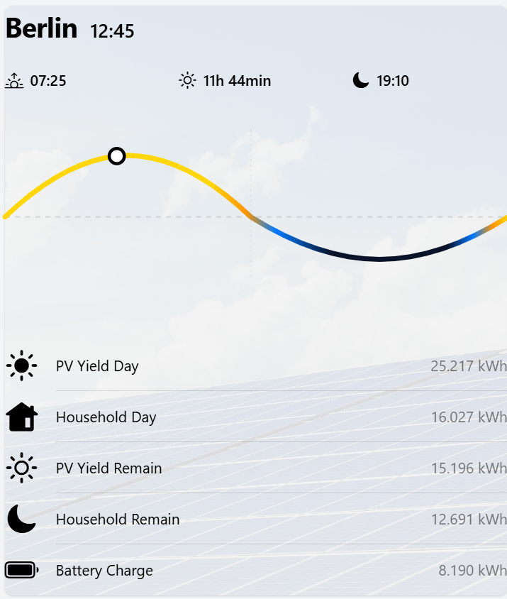
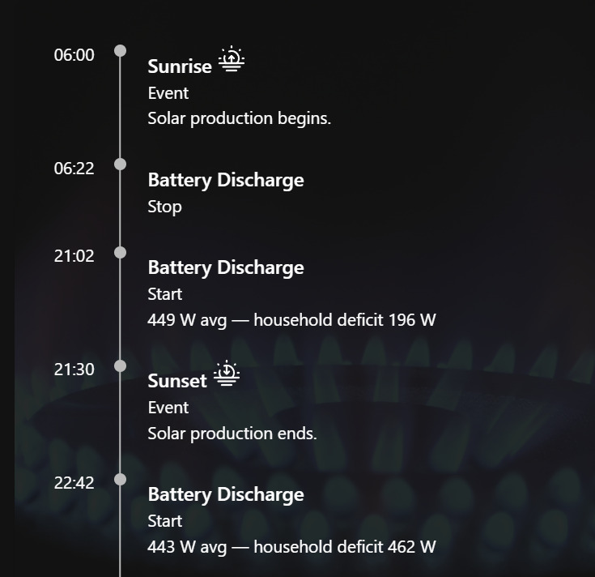
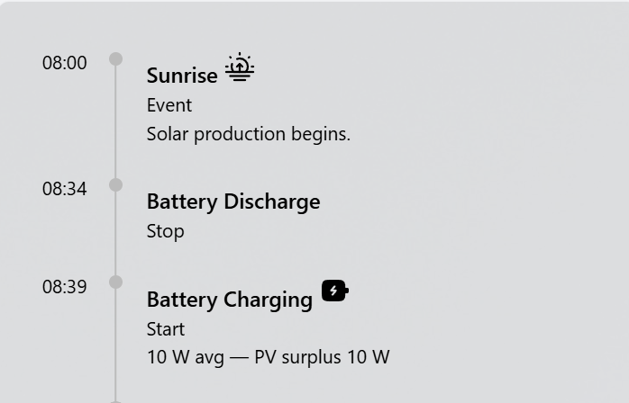

# openHAB Widgets

Two custom MainUI widgets for solar and energy dashboards. The widget YAML files can be added as custom widgets in openHAB MainUI, then placed on a page and configured with the relevant items.

## Solar Arc

[`solarwave/solarwave.yaml`](solarwave/solarwave.yaml) draws a 24-hour solar arc from sunrise to sunset. A moving marker shows the current time, with the arc representing daylight and the flatter curves representing the night periods. The widget also displays daylight duration, sunrise, solar noon, and sunset.

Configure the widget with:

| Parameter | Required | Item value |
| --- | --- | --- |
| Sunrise Item | Yes | Numeric state: minutes since midnight (for example, `441` for 07:21) |
| Sunset Item | Yes | Numeric state: minutes since midnight (for example, `1077` for 17:57) |
| Solar Noon Item | No | Solar noon time; omitted values display as `--` |
| Total Daylight Item | No | Text duration (for example, `10 hrs, 36 min`) |

The sunrise and sunset items should have numeric states for plotting. Their item states are also used for the labels shown below the chart.

| Dark theme | Light theme |
| --- | --- |
|  |  |

## Timeline

The Timeline widget presents ordered events with a time, icon, title, subtitle, and description. It is useful for showing expected solar, battery, or household-energy events through the day.

- [`timeline/timeline-json-feed.yaml`](timeline/timeline-json-feed.yaml) is the data-driven widget. Set its required **Timeline Item** parameter to a String item whose state is JSON containing an `entries` array. Each entry uses `time`, `title`, `icon`, `subtitle`, and `description` fields. An empty or missing `entries` array displays no events.
- [`timeline/timeline.json`](timeline/timeline.json) shows a sample feed. The configured item should contain the JSON as its state; this file is an example, not read directly by the widget.
- [`timeline/timeline-example.yaml`](timeline/timeline-example.yaml) is a static layout example with sample timeline entries.

| Dark theme | Light theme |
| --- | --- |
|  |  |
